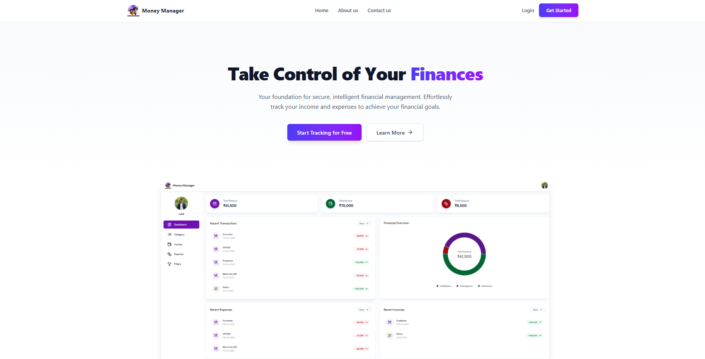
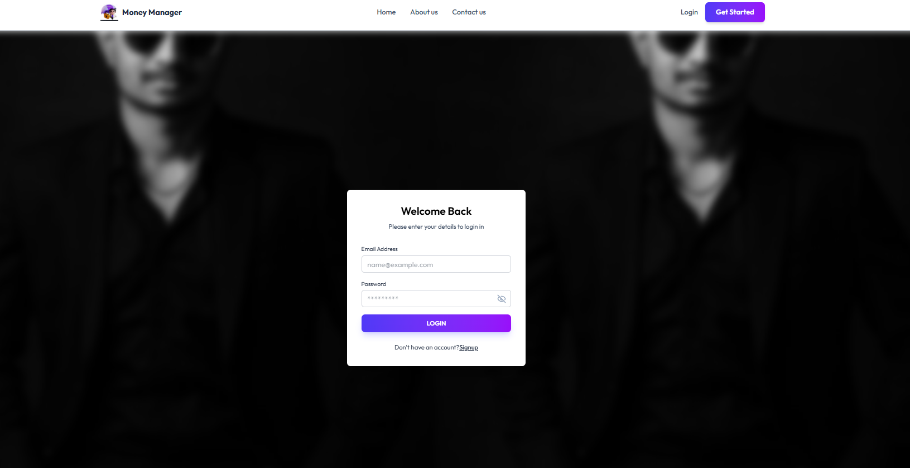

# 💰 Money Manager - Personal Finance Tracker

<div align="center">


**A comprehensive personal finance management application to track income, expenses, and maintain financial health**

[](https://moneymanagerfrontendd.netlify.app/)
[](https://github.com/Rohit6168/money-manager-forntend)
[](https://reactjs.org/)
[](https://netlify.com/)

</div>

---

## 📋 Table of Contents

- [Overview](#-overview)
- [Features](#-features)
- [Tech Stack](#-tech-stack)
- [Screenshots](#-screenshots)
- [Getting Started](#-getting-started)
- [Project Structure](#-project-structure)
- [API Endpoints](#-api-endpoints)
- [Key Functionalities](#-key-functionalities)
- [Contributing](#-contributing)
- [License](#-license)
- [Contact](#-contact)

---

## 🌟 Overview

Money Manager is a full-stack personal finance management application that helps users track their income and expenses effortlessly. Built with React and Spring Boot, this application provides a user-friendly interface to manage financial transactions, categorize spending, and gain insights into financial habits through interactive charts and reports.

### 🎯 Key Highlights

- 💼 **Income & Expense Tracking** - Comprehensive financial transaction management
- 📊 **Visual Analytics** - Interactive charts and graphs for financial insights
- 📧 **Email Verification** - Secure account activation via email
- 🖼️ **Profile Image Upload** - Cloudinary integration for image storage
- 📑 **Category Management** - Customizable income and expense categories
- 🔍 **Advanced Filtering** - Filter transactions by date, amount, and category
- 📥 **Export & Email** - Download Excel reports or send via email
- 📱 **Responsive Design** - Works seamlessly across all devices

---

## ✨ Features

### 🔐 Authentication & Security
- ✅ **User Registration** with profile image upload
- 📧 **Email Verification** - Account activation link sent to email
- 🔑 **Secure Login** - Only verified users can access the dashboard
- 🖼️ **Cloudinary Integration** - Secure image storage and retrieval
- 🔒 **JWT Authentication** - Token-based secure API access

### 📊 Dashboard
- 💵 **Total Balance** - Real-time calculation of financial status
- 💚 **Total Income** - Sum of all income transactions
- 🔴 **Total Expense** - Sum of all expense transactions
- 📈 **Financial Overview Chart** - Visual representation of finances
- 📝 **Recent Transactions** - Quick view of latest activities
- 💼 **Recent Income & Expenses** - Categorized transaction lists

### 📂 Category Management
- ➕ **Add Custom Categories**
  - Income categories (Salary, Freelance, Bonus, etc.)
  - Expense categories (WiFi, Groceries, Rent, etc.)
- 🎨 **Custom Icons** - Select from emoji library
- 🏷️ **Category Types** - Distinguish between income and expense
- ✏️ **Edit & Delete** - Manage categories easily

### 💰 Income Management
- ➕ **Add Income**
  - Select custom icon/emoji
  - Choose income source
  - Select category
  - Enter amount
  - Set date
- 📊 **Income Overview** - Line chart showing income trends over time
- 📑 **Income Sources List** - All income transactions with details
- 📥 **Export Options** - Email or download income data
- 🔍 **Search & Filter** - Find specific income records

### 💸 Expense Management
- ➕ **Add Expense**
  - Select custom icon/emoji
  - Enter expense name
  - Choose category
  - Enter amount
  - Set date
- 📈 **Expense Overview** - Line chart displaying expense trends
- 📑 **All Expenses List** - Complete expense transaction history
- 📥 **Export Options** - Email or download expense data
- 🔍 **Search & Filter** - Locate specific expense records

### 🔎 Advanced Filtering
- 📅 **Date Range Filter**
  - Start Date selection
  - End Date selection
- 💵 **Sort Options**
  - Sort by Date
  - Sort by Amount
  - Sort by Category
- 🔄 **Sort Order**
  - Ascending
  - Descending
- 🔍 **Search Functionality** - Real-time search across transactions
- 🎯 **Type Filter** - Filter by Income or Expense

### 📊 Reports & Analytics
- 📈 **Income Overview Chart** - Visual representation of earnings
- 📉 **Expense Overview Chart** - Spending pattern visualization
- 🥧 **Financial Overview Donut Chart** - Balance distribution
- 📊 **Trend Analysis** - Track financial habits over time
- 💹 **Percentage Change** - See growth or decline indicators

### 📥 Export & Communication
- 📧 **Email Reports** - Send financial reports directly to email
- 📊 **Excel Export** - Download transactions as Excel spreadsheet
- 📄 **PDF Reports** - Generate PDF documents (coming soon)
- 📨 **Automated Emails** - Transaction confirmations and alerts

---

## 🛠 Tech Stack

### Frontend


- ⚛️ **React 18** - UI library for building interactive interfaces
- ⚡ **Vite** - Lightning-fast build tool with HMR (Hot Module Replacement)
- 🎨 **CSS3** - Styling and responsive design
- 📊 **Recharts** - Charting library for data visualization
- 🧭 **React Router** - Client-side routing
- 🌐 **Axios** - HTTP client for API communication
- 🎭 **React Icons** - Icon library
- 😊 **Emoji Picker React** - For category icon selection

### Backend


- 🍃 **Spring Boot 3.x** - Backend framework
- ☕ **Java 17** - Programming language
- 🔒 **Spring Security** - Authentication & authorization
- 💾 **Spring Data JPA** - Database operations
- 🗄️ **MySQL** - Relational database
- 🎫 **JWT** - Token-based authentication
- 📧 **JavaMail** - Email service for verification
- ☁️ **Cloudinary SDK** - Image upload and management

### Cloud Services


- ☁️ **Cloudinary** - Cloud-based image storage and delivery

### Backend Tools & Libraries


- 📊 **Apache POI** - Excel file generation
- 📧 **Email Templates** - HTML email formatting
- 🔐 **BCrypt** - Password encryption

### Deployment


- 🌐 **Netlify** - Frontend hosting with continuous deployment
- 🔄 **CI/CD** - Automated deployment from GitHub
- 📦 **Build Optimization** - Production-ready builds with Vite

---

## 📸 Screenshots

### 🏠 Landing Page & Authentication
<table>
  <tr>
    <td><br/><b>Landing Page</b></td>
    <td><br/><b>Registration Page</b></td>
  </tr>
  <tr>
    <td><br/><b>Login Page</b></td>
    <td><br/><b>Email Verification</b></td>
  </tr>
  <tr>
    <td colspan="2"><br/><b>Profile Activated</b></td>
  </tr>
</table>

### 📂 Category Management
<table>
  <tr>
    <td><br/><b>Add Category Modal</b></td>
    <td><br/><b>Emoji Icon Selection</b></td>
  </tr>
</table>

### 💰 Income Management
<table>
  <tr>
    <td><br/><b>Add Income Modal</b></td>
    <td><br/><b>Income Dashboard</b></td>
  </tr>
</table>

### 💸 Expense Management
<table>
  <tr>
    <td><br/><b>Add Expense Modal</b></td>
    <td><br/><b>Expense Dashboard</b></td>
  </tr>
</table>

### 📊 Dashboard & Analytics
<table>
  <tr>
    <td><br/><b>Main Dashboard</b></td>
    <td><br/><b>Financial Overview Chart</b></td>
  </tr>
</table>

### 🔍 Filtering & Reports
<table>
  <tr>
    <td><br/><b>Advanced Filters</b></td>
  </tr>
</table>

---

## 🚀 Getting Started

### Prerequisites

- 💻 **Node.js** (v18 or higher)
- ☕ **Java JDK** (v17 or higher)
- 🗄️ **MySQL** (v8 or higher)
- 📦 **Maven** (v3.6 or higher)
- 🔧 **Git**
- ☁️ **Cloudinary Account** (for image storage)

### Frontend Setup

1. **📥 Clone the repository**
   ```bash
   git clone https://github.com/Rohit6168/money-manager-forntend.git
   cd money-manager-forntend
   ```

2. **📦 Install dependencies**
   ```bash
   npm install
   ```

3. **⚙️ Configure environment variables**
   
   Create a `.env` file in the root directory:
   ```env
   REACT_APP_API_BASE_URL=http://localhost:8080/api
   REACT_APP_CLOUDINARY_CLOUD_NAME=your_cloud_name
   REACT_APP_CLOUDINARY_UPLOAD_PRESET=your_upload_preset
   ```

4. **🚀 Start development server**
   ```bash
   npm start
   ```
   
   The application will run on `http://localhost:3000`

5. **🏗️ Build for production**
   ```bash
   npm run build
   ```

6. **🌐 Deploy to Netlify**
   
   The app is configured for Netlify deployment. You can deploy by:
   - Connecting your GitHub repository to Netlify
   - Or using Netlify CLI:
   ```bash
   npm install -g netlify-cli
   netlify deploy --prod
   ```

**🌍 Live Demo:** [https://moneymanagerfrontendd.netlify.app/](https://moneymanagerfrontendd.netlify.app/)

### Backend Repository

The backend for this project is maintained in a separate repository:

**🔗 Backend Repository:** [money-manager-backend](https://github.com/Rohit6168/money-manager-backend)

Please refer to the backend repository for setup instructions and API documentation.

---

## 📁 Project Structure

```
money-manager-forntend/
├── public/
│   ├── index.html
│   └── assets/
├── src/
│   ├── components/
│   │   ├── Auth/
│   │   │   ├── SignUp.jsx
│   │   │   ├── Login.jsx
│   │   │   └── EmailVerification.jsx
│   │   ├── Dashboard/
│   │   │   ├── Dashboard.jsx
│   │   │   ├── FinancialChart.jsx
│   │   │   └── TransactionCard.jsx
│   │   ├── Category/
│   │   │   ├── AddCategory.jsx
│   │   │   ├── CategoryList.jsx
│   │   │   └── EmojiPicker.jsx
│   │   ├── Income/
│   │   │   ├── AddIncome.jsx
│   │   │   ├── IncomeOverview.jsx
│   │   │   └── IncomeList.jsx
│   │   ├── Expense/
│   │   │   ├── AddExpense.jsx
│   │   │   ├── ExpenseOverview.jsx
│   │   │   └── ExpenseList.jsx
│   │   ├── Filters/
│   │   │   └── FilterPanel.jsx
│   │   └── Common/
│   │       ├── Navbar.jsx
│   │       ├── Sidebar.jsx
│   │       └── Layout.jsx
│   ├── pages/
│   │   ├── Home.jsx
│   │   ├── DashboardPage.jsx
│   │   ├── IncomePage.jsx
│   │   ├── ExpensePage.jsx
│   │   └── FilterPage.jsx
│   ├── services/
│   │   ├── api.js
│   │   ├── authService.js
│   │   ├── categoryService.js
│   │   ├── incomeService.js
│   │   ├── expenseService.js
│   │   └── cloudinaryService.js
│   ├── utils/
│   │   ├── dateFormatter.js
│   │   ├── currencyFormatter.js
│   │   └── validators.js
│   ├── context/
│   │   └── AuthContext.jsx
│   ├── App.jsx
│   ├── App.css
│   └── index.js
├── .env
├── package.json
└── README.md
```

---

## 🔌 API Endpoints

### 🔐 Authentication Endpoints
```javascript
POST   /api/auth/register        - 📝 User registration with image upload
POST   /api/auth/login           - 🔑 User login
GET    /api/auth/verify          - ✅ Email verification via token
GET    /api/auth/user            - 👤 Get authenticated user details
POST   /api/auth/logout          - 🚪 User logout
```

### 📂 Category Endpoints
```javascript
POST   /api/categories           - ➕ Create new category
GET    /api/categories           - 📋 Get all categories
GET    /api/categories/{id}      - 🔍 Get specific category
PUT    /api/categories/{id}      - ✏️ Update category
DELETE /api/categories/{id}      - 🗑️ Delete category
GET    /api/categories/type/{type} - 📊 Get categories by type (Income/Expense)
```

### 💰 Income Endpoints
```javascript
POST   /api/income               - ➕ Add new income
GET    /api/income               - 📋 Get all income records
GET    /api/income/{id}          - 🔍 Get specific income
PUT    /api/income/{id}          - ✏️ Update income
DELETE /api/income/{id}          - 🗑️ Delete income
GET    /api/income/filter        - 🔎 Filter income records
GET    /api/income/export/excel  - 📊 Export income to Excel
POST   /api/income/email         - 📧 Email income report
```

### 💸 Expense Endpoints
```javascript
POST   /api/expense              - ➕ Add new expense
GET    /api/expense              - 📋 Get all expense records
GET    /api/expense/{id}         - 🔍 Get specific expense
PUT    /api/expense/{id}         - ✏️ Update expense
DELETE /api/expense/{id}         - 🗑️ Delete expense
GET    /api/expense/filter       - 🔎 Filter expense records
GET    /api/expense/export/excel - 📊 Export expense to Excel
POST   /api/expense/email        - 📧 Email expense report
```

### 📊 Dashboard Endpoints
```javascript
GET    /api/dashboard/summary    - 📈 Get financial summary
GET    /api/dashboard/chart-data - 📊 Get chart data for visualizations
GET    /api/dashboard/recent     - 📝 Get recent transactions
```

### 🖼️ Image Upload
```javascript
POST   /api/upload/image         - 📤 Upload image to Cloudinary
```

---

## 🔑 Key Functionalities

### 1️⃣ User Registration with Image Upload

When a user registers:
- Profile image is uploaded to **Cloudinary**
- User details are stored in the database
- Verification email is sent with activation link
- Account status remains **"Pending"** until verified

**Technology Used:**
- Frontend: FormData API for multipart/form-data
- Backend: MultipartFile handling in Spring Boot
- Cloud: Cloudinary Java SDK for image storage

### 2️⃣ Email Verification System

**Workflow:**
1. User registers → Backend generates unique verification token
2. Verification link sent to user's email
3. User clicks link → Token validated
4. Account status changed to **"Verified"**
5. User can now login

**Implementation:**
```java
// Backend - Token generation
String token = UUID.randomUUID().toString();
user.setVerificationToken(token);
emailService.sendVerificationEmail(user.getEmail(), token);
```

### 3️⃣ Category Management with Emoji Icons

Users can create custom categories for income and expense:
- Select emoji from picker
- Enter category name
- Choose type (Income/Expense)
- Categories are user-specific

### 4️⃣ Transaction Management

**Add Transaction Flow:**
1. User selects category
2. Enters amount and date
3. Adds description/source
4. Transaction saved to database
5. Dashboard automatically updates

### 5️⃣ Advanced Filtering System

Users can filter transactions by:
- **Date Range**: Start date to end date
- **Type**: Income or Expense
- **Amount**: Ascending or descending
- **Category**: Specific categories
- **Search**: Keyword search

### 6️⃣ Export & Email Features

**Excel Export:**
- Apache POI generates Excel workbook
- Formatted sheets with headers
- Color-coded income (green) and expense (red)
- Downloadable instantly

**Email Reports:**
- HTML formatted email template
- Transaction summary included
- Sent via JavaMail API
- Automatic email delivery

### 7️⃣ Real-time Dashboard

The dashboard provides:
- **Total Balance** = Total Income - Total Expense
- **Income Trend Chart** - Line chart using Recharts
- **Expense Trend Chart** - Visual spending patterns
- **Financial Overview** - Donut chart showing distribution
- **Recent Transactions** - Latest 5 transactions

---

## 🎨 Design Features

### Color Scheme
- **Primary Purple**: `#7C3AED` - Buttons, highlights
- **Green**: `#10B981` - Income indicators
- **Red**: `#EF4444` - Expense indicators
- **White**: `#FFFFFF` - Backgrounds
- **Gray Shades**: For text and borders

### Responsive Design
- ✅ Desktop (1920px and above)
- ✅ Laptop (1366px - 1920px)
- ✅ Tablet (768px - 1366px)
- ✅ Mobile (320px - 768px)

### User Experience
- 🎨 Clean and modern UI
- ⚡ Fast page transitions
- 📱 Touch-friendly interfaces
- 🔔 Toast notifications for actions
- ⌨️ Keyboard shortcuts support

---

## 🔒 Security Features

- 🔐 **JWT Authentication** - Secure token-based auth
- 🔑 **Password Encryption** - BCrypt hashing
- ✉️ **Email Verification** - Prevents fake accounts
- 🛡️ **CORS Configuration** - Controlled API access
- 🔒 **SQL Injection Prevention** - Parameterized queries
- 🚫 **XSS Protection** - Input sanitization

---

## 🤝 Contributing

Contributions are welcome! Please follow these steps:

1. **🍴 Fork the repository**
2. **🌿 Create a feature branch**
   ```bash
   git checkout -b feature/AmazingFeature
   ```
3. **💾 Commit your changes**
   ```bash
   git commit -m 'Add some AmazingFeature'
   ```
4. **📤 Push to the branch**
   ```bash
   git push origin feature/AmazingFeature
   ```
5. **🔃 Open a Pull Request**

---

## 📝 License

This project is licensed under the MIT License - see the [LICENSE](LICENSE) file for details.

---

## 📧 Contact

**Rohit Nilesh Lokhande**

- 🐙 GitHub: [@Rohit6168](https://github.com/Rohit6168)
- 📧 Email: rohitlokhande616@gmail.com
- 💼 LinkedIn: [Rohit Lokhande](https://www.linkedin.com/in/rohit-lokhande-070262376/)
- 🌐 Portfolio: [https://rohitlokhandeportfolio.netlify.app/](https://rohitlokhandeportfolio.netlify.app/)
- 🔗 Frontend Repository: [https://github.com/Rohit6168/money-manager-forntend](https://github.com/Rohit6168/money-manager-forntend)
- 🔗 Backend Repository: [https://github.com/Rohit6168/money-manager-backend](https://github.com/Rohit6168/money-manager-backend)
- 🌐 Live Demo: [https://moneymanagerfrontendd.netlify.app/](https://moneymanagerfrontendd.netlify.app/)

---

## 🙏 Acknowledgments

- ☁️ [Cloudinary](https://cloudinary.com/) - Image storage and delivery
- 📊 [Recharts](https://recharts.org/) - Beautiful React charts
- 📧 [JavaMail API](https://javaee.github.io/javamail/) - Email functionality
- 📊 [Apache POI](https://poi.apache.org/) - Excel file generation
- 🎨 [React Icons](https://react-icons.github.io/react-icons/) - Icon library
- 😊 [Emoji Picker React](https://www.npmjs.com/package/emoji-picker-react) - Emoji selection
- ⚡ [Vite](https://vitejs.dev/) - Next generation frontend tooling
- 🌐 [Netlify](https://www.netlify.com/) - Hosting and deployment

---

## 🚀 Future Enhancements

- 📱 **Mobile App** - React Native version for iOS and Android
- 📊 **Advanced Analytics** - AI-powered financial insights and predictions
- 💳 **Budget Planning** - Set monthly budgets with alerts
- 🔔 **Smart Notifications** - Bill reminders and spending alerts
- 🌍 **Multi-currency Support** - Handle different currencies with live exchange rates
- 📈 **Investment Tracking** - Track stocks, mutual funds, and cryptocurrency
- 👥 **Family Accounts** - Shared expense tracking for families
- 🤖 **AI Chatbot** - Financial advice and spending pattern analysis
- 📊 **Custom Reports** - Generate detailed financial reports
- 🔗 **Bank Integration** - Automatic transaction import from banks
- 💰 **Savings Goals** - Set and track savings targets
- 📲 **Mobile Notifications** - Push notifications for important updates

---

<div align="center">

**Made with ❤️ by Rohit Lokhande**

⭐ Star this repository if you found it helpful!

[](https://github.com/Rohit6168/money-manager-forntend)
[](https://github.com/Rohit6168/money-manager-forntend/fork)
[](https://moneymanagerfrontendd.netlify.app/)

</div>
